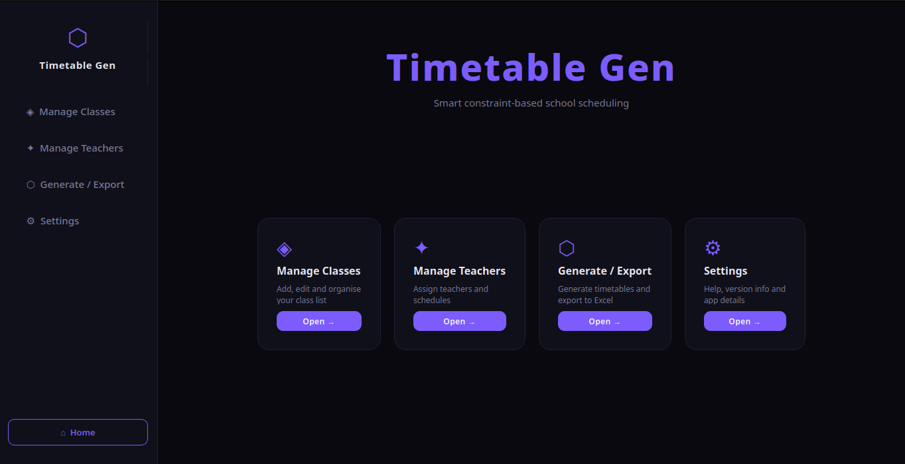
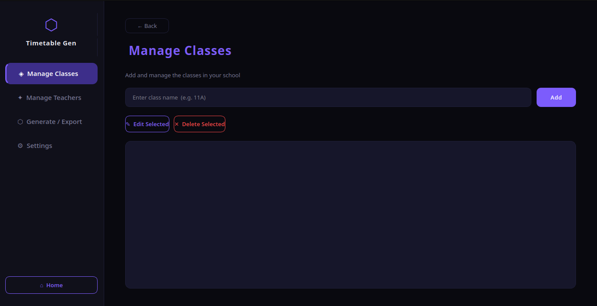
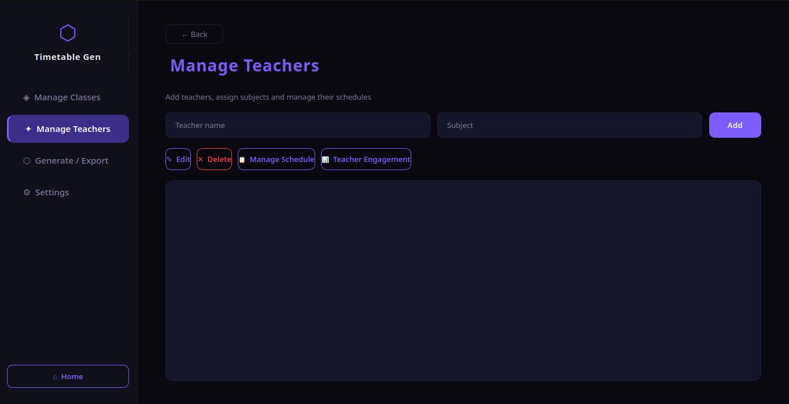
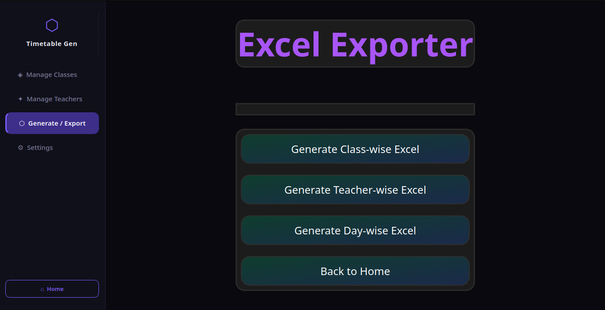
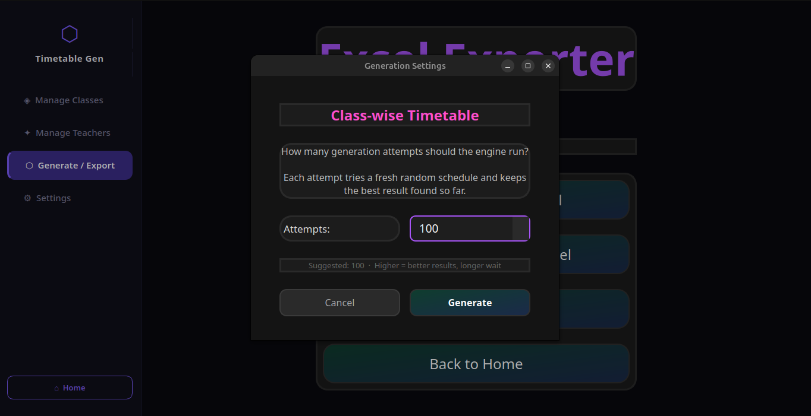
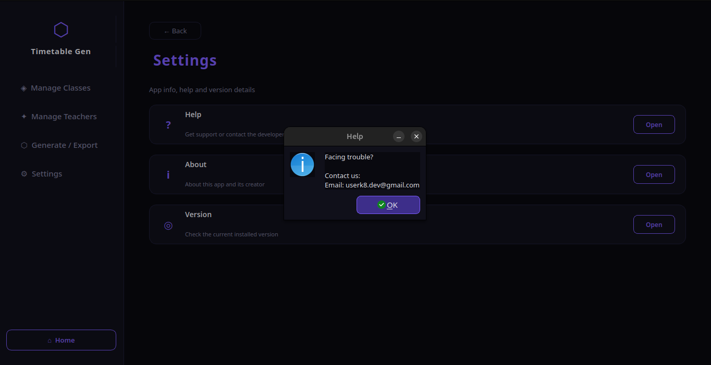
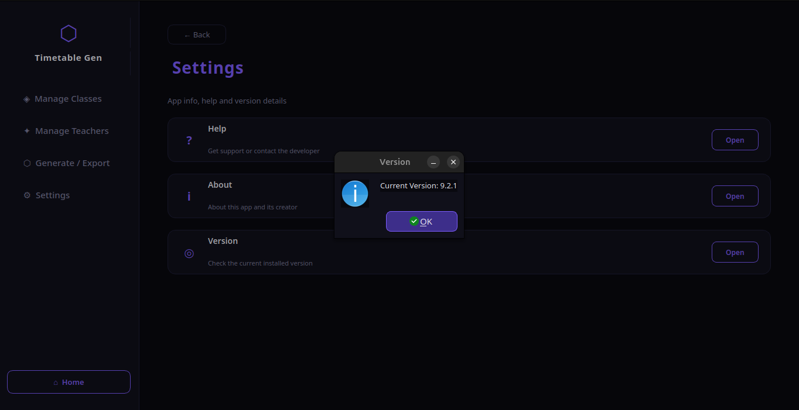

# 🗓️ STT — School Time Table

[](https://www.python.org/)
[](https://github.com/USERK8/stt/releases)

An advanced **constraint-based timetable generator** built for schools following KVS timetable guidelines.

---

## 🚀 Purpose

STT intelligently generates school timetables while respecting:

- Teacher workload limitations  
- Class availability constraints  
- Lab period allocation for Classes 11 & 12  
- Mathematics period distribution for:
  - Bio-Maths students  
  - Computer Science–Maths students  
  - Commerce with Maths students  
- Fully structured, conflict-free scheduling  
- Export of generated timetables in **Excel format** for easy customization and editing  

Every timetable generated is **optimized, constraint-aware, and logically structured**.

> Built for Viksit Bharat and Digital India, STT modernizes school systems — moving from manual scheduling to **efficient, tech-driven planning**.  
> Goal: *“Make schools smarter, more organized, and future-ready.”*

---

## 🏫 Features

- Timetable generation for Classes 6–12  
- Three sections per class (adjustable in-app)  
- Teacher-wise timetable  
- Class-wise timetable  
- Day-wise timetable  
- Export timetables to **Excel files**  
- Fully offline functionality (some updates may require internet)

---

## 🖼️ Screenshots

### Home Screen


### Class Editor and Management


### Teacher Management


### Generation Options


### Settings Menu


### Generation Tools


### Settings Help Menu


### Settings Version Details


---

## 🔐 Privacy & Security

- No client-side data collection  
- Completely self-contained  
- No background tracking  

---

## 💻 Platform Support

- **Linux (64-bit)** — fully supported  
- **Windows** — run source code via Python, or use packaged release  

---

## 🛠 Built With

- **Python**  
- **PyQt6** for UI management  
- Continuous logic improvements, UI updates, and bug fixes  

---

## 🐧 Linux Installation Manual

### 1️⃣ System Requirements

- 64-bit Linux OS (Ubuntu, Kali, Debian, Fedora, Arch, Pop!_OS recommended)  
- Latest Python version  

---

### 2️⃣ Install Dependencies

**Ubuntu / Kali / Debian:**

```bash
sudo apt update
sudo apt install -y build-essential libssl-dev zlib1g-dev \
libncurses5-dev libncursesw5-dev libreadline-dev libsqlite3-dev \
libgdbm-dev libdb5.3-dev libbz2-dev libexpat1-dev liblzma-dev \
tk-dev libffi-dev wget
```

### 3️⃣ Download the App

- Go to the **Releases** section of the repository  
- Navigate to the **latest release**  
- Download the file named **Timetable-Gen.zip**  
- Extract the ZIP file into a separate folder  

---

### 4️⃣ Run the Application

Inside the extracted folder:

- You will see dependency files — **do not modify or delete them**  
- You will also see the main application labeled **Timetable-Gen**

To run the app:

- Double-click **Timetable-Gen**  

If you encounter an executable error:

- Right-click the file → **Properties**  
- Go to **Permissions**  
- Enable **“Allow executing file as program”**  
- Apply changes and run again  

---

### 5️⃣ Using the App

- Modify teacher names  
- Adjust class availability  
- Assign subjects  
- Generate timetables:
  - Class-wise  
  - Teacher-wise  
  - Day-wise  

Timetable management becomes structured, efficient, and easy to maintain.

---

## 🪟 Windows Users

- Official executable is under development  
- Source code can be run using Python  
- Future releases will include packaged builds  

---

## ⚠️ Trial Version Notice

- This is a trial version  
- Active development continues  
- Built by USERK8  
- No user data is collected  

---

## 📩 Support

Email: userk8.dev@gmail.com  

Thanks for trying STT! Your feedback helps improve the system and supports building smarter, future-ready schools.
